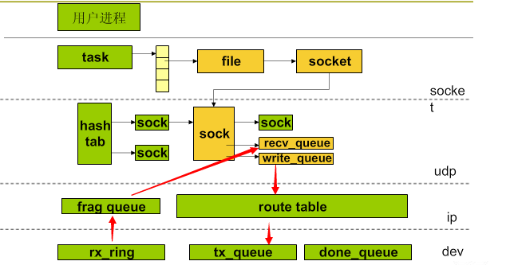

Title: Linux内核策略介绍学习笔记
Date: 2014-7-28 20:20
Modified: 2014-7-28 20:20
Category: 系统
Tags: linux
Slug: linux-kernel-introduce
Author: jacksu
Summary:在上周听了mike的关于linux内核策略的分享，这可是一个长达四个小时的分享，其中一句话印象非常深刻就是，“好的系统性能不是压测出来的，是设计出来的”。内容主要通过后台服务依赖的硬件资源（CPU、内存、外存、网络、其他）主线来介绍的。

#主要内容

| 硬件        | 策略  |  
| :--------: | :-----:  |
|CPU         |进程调度、系统调用、中断|
|内存         |内存管理|
|外存         |文件IO|
|网络         |协议栈|
|其他         |时间管理|

---------
##进程调度

###内核的运行时间

系统启动、中断发生、系统调用以及**内核线程**。

###进程和线程的区别

> * 在linux中，底层都是调用clone函数。
> * 进程创建为60～8000次/s，线程为5～10w/s
> * 进程创建调用fork()，主要瓶颈在页表复制，如果一个进程没有访问内存，页表共享的内存栈不需要复制页表。（例如：一个网络处理服务，只是收到包，fork进程进行内存访问，性能应该在一万左右，但是如果主进程简单做一些处理的话，性能就会下降为一千左右。）
> * 线程创建调用pthread_create(),主要瓶颈在堆栈(8k)分配上，如果并发线程增多1w时约为5w
> * 并发性能CPU切换，进程30～100w/s,线程50～150w/s
> * 内存消耗，进程要比线程更消耗内存(3~N倍)

###进程调度

> * sched_yield更细粒度让出cpu
> * 各个核都有自己的运行队列
> * 就近balance原则，运行clone、wakeup的进程就在该核
> * CPU绑定函数sched_setaffinity

##中断
> * 通过/proc/interrupt查看中断
> * 中断主要来源于时钟、网卡、硬盘
> * 通过/proc/irq/N/smp_affinity查看在那个核
> * 调度顺序：硬中断调度－>软中断－>进程调度

##常用系统调用性能

是在C类机器测试，自己使用最好在自己的机器类型测试。

||性能（次/秒）|
|:-----:|:------:|
|ntohl|2.5亿|
|memset 1k|150w|
|getppid|100w|
|gettimeofday|30~400w|
|time|30w~400w~1000w|
|shmget|300w|
|shmat|40w|
|socket|10w~50w|
|sendto|40w|
|fork||60~8000|
|pthread_create|5~10w|

###工具
> * stack
> * perf

-----------
##内存管理

> * 查看进程地址空间/proc/PID/maps或者pmap
> * 防止内存交换出去调用mlock，如果内存使用非常紧张的时候得注意
> * 空闲内存计算：/proc/meminfo查看，MemFree+cached+buffer-Mapped

##共享内存建立方法

> * IPC 我们经常使用
> * shm_open，文件操作，方便append和dump
> * tmpfs可以直接挂载到某个盘
> * hugetlbfs节省页表空间

##内存权限

||shared|private|
|:---:|:---:|:---:|
|File|共享内存|数据段、代码段|
|anon|父子进程|堆|

-------
##文件IO

文件系统层次架构

> * VFS Layer
> * NFS EXT2 EXT3 NTFS
> * Page Cache
> * Generic Block Layer
> * I/O Scheduler Layer
> * Block Device Driver Layer
> * Block Device Layer

PageCache起了缓存得作用，采用read ahead机制，如果我们顺序读性能比较好，随机读性能就比较差了。对于写，如果在pagecache中存在，那么直接写PacheCache中的页就可以，否则需要加载该页内容，然后写入PageCache，最后delay write。

虚拟文件系统为filetab[fd]->file->dentry->inode->mapping.dentry采用全局hash，查找性能为30～35w/s,100w个文件也为30w/s。

EXT3添加了日志模式，由高到低为journal、ordered、writeback

##协议栈

* recv_queue中的包大小，为内核的包大小，而不是ip包大小。

* 如果发出去的包太大，需要修改write_queue和tx_queue两个参数，tx_queue主要是流量控制。
* 多进程必须在socket后再fork，即使设置了REUSEADDR，从hashtable看出原因。
* net.ipv4.tcp_max_syn_backlog参数决定了SYN_RECV状态队列的数量，一般默认值为512或者1024，即超过这个数量，系统将不再接受新的TCP连接请求.
* [sync cookie](http://blog.csdn.net/justlinux2010/article/details/12619761),外网要注意，同一个集线器来的用户，可能导致大量不可以建立链接。
* somaxconn决定了listen监听队列的大小
* select有1024的限制，即使没有达到1024，但是分配的fd大于1024也会有问题。
* epoll多用于单进程多线程

##时间
* gettimeofday根据硬件不同性能差距很大
* usleep(1),睡眠不一定是1微妙，有可能是毫秒级的，也和硬件有关。

##参考文献

man 2

man 7

ULK

